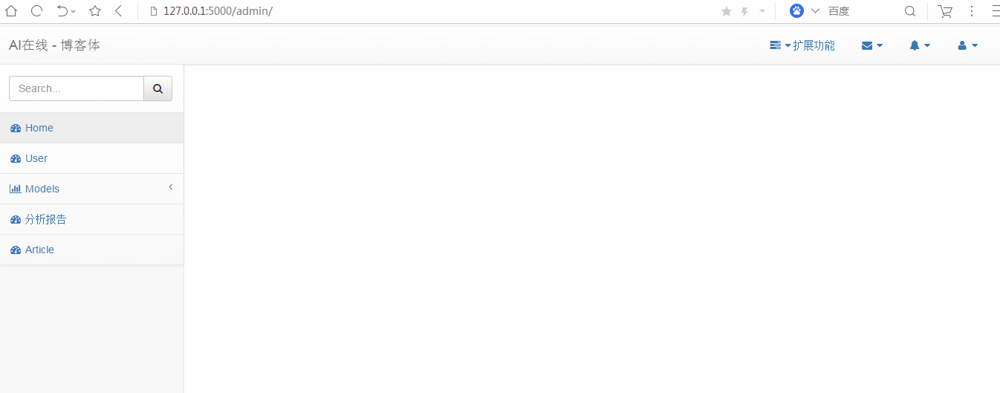
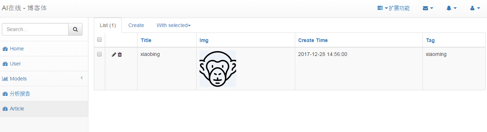
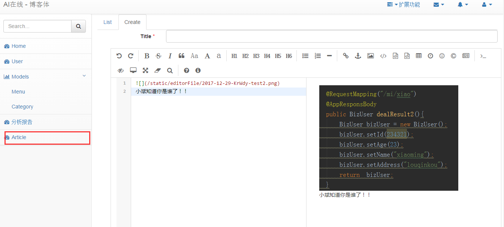

# 欢迎使用flaskBlog
A blog framework developed by flask and flask_admin 
------

flask对于我来说，适合快速开发一些小网页,自己也想整一个博客就写了这个blog的后端，其实也就是做了简单的整合：

> * 整合flask_admin 实现后台的自动生成
> * 整合bootstrap的startbootstrap-sb-admin-2-gh-pages 后端框架
> * 整合editorMd编辑器，当然样式不是很好看，够用就行
> * 全局错误跳转及其他细节的处理

## 首页需要自定义


## 列表页


## 编辑页面


接下来分别做一下简单的介绍：
## 依赖的环境
python3+
可以查看requestment.txt

## 安装
1，项目拉下来
```
git clone https://github.com/minsons/flaskBlog.git
```
2,修改数据库及其配置
在config.py 修改数据 SQLALCHEMY_DATABASE_URI为自己的数据库 
在gendb.py 的目录环境下，执行以下命令：

```
python gendb.py db init 
python gendb.py db migrate
python gendb.py db upgrade
```
就会生成相应的数据库，即可正常工作了
可以直接pycharm控制台启动也可以命令行启动
python flaskAdmin.py


待续 。。。 。。。

急用可以联系QQ：1461102191
